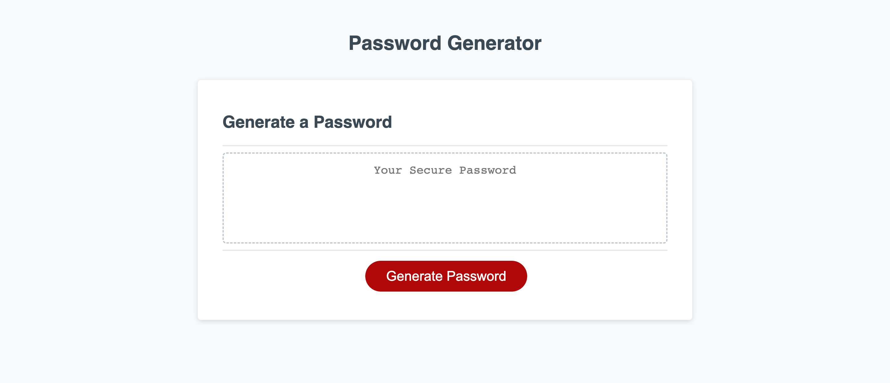

# random-password-generator

## Description
In this weeks module the task was to create a random password generator through javascript. to accomplish this we had to meet a number of criteria such as the number of characters the user wants in their password and promting the user to ask if they want to include uppercase and lowercase letters, numbers, or special characters. to do this we had to include parameters which the answers must coincide with so we used alerts and confirms to limit and help direct users when inputing their password specifications as well as if statements and for loops to check whether the user inputs can be properly implemented.

## Project Link

## Screenshot

## Usage
This web page can be used to create random passwords for online accounts, which would be a more secure option than using a man made password. It can also be used to see how alerts, prompts, and confirms can be implemented in JavaScript as well as for loops, and if statements.